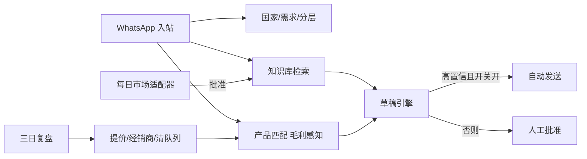

# 架构：用经营中台逼近 10 亿，而不是假装已经到达

## 目标与诚实原则

- **假设（可配置，非正式财报）：** 当前销售 ¥1500 万，五年目标 ¥10 亿，利润率地板 ≥15%。  
- **路径数学：** `CAGR = (10亿 / 0.15亿)^(1/5) - 1 ≈ 131.6%`。看板原样展示这条曲线，并写明这是倒推，不是已实现收入。  
- **毛利地板：** 产品匹配、报价模板、自动回复共用 `marginFloorPercent`。低于地板的 SKU 仍可见，但降权且不得进入自动报价句。  
- **数据诚实：** 种子目录、公开网页整理的 9ZT-0.6 参数、演示询盘一律 `isSample` /「演示数据」。报告禁止把样本价写成公司业绩。

## 模块如何服务销售目标

| 模块 | 对 10 亿的作用 | 对 ≥15% 毛利的作用 |
| --- | --- | --- |
| 看板 | 每年必须达到的销售与最低利润数字，避免「感觉在增长」 | KPI 与低毛利 SKU 告警 |
| 知识库 | 缩短响应、沉淀售后与方案，提高转化 | 「报价话术」明确禁止破底线 |
| 产品匹配 | 按国家+需求推方案包，提高客单 | 达标机型加权，亏损 SKU 降权 |
| 聊天 | WhatsApp Web 式窗口：来信、人工发送、AI 草稿批准在同一线程 | 自动回复只在毛利安全时发生 |
| 市场情报 | 知道当地电压/价格带，避免错配 | 不跟地摊价 |
| 三日复盘 | 批评线索量级与 A 类客户缺口 | 点名破底线 SKU 并要求改价 |

五年 66 倍不是靠把自动回复打开。复盘任务会写明：缺经销商（A 层）、目录仍是样本、待审情报未入库时，路径不可信。

## 运行时

- **Web：** Next.js App Router，页面调 `/api/*`。  
- **数据：** Prisma + SQLite（`prisma/dev.db`）。知识检索 = FTS5 + 中文 2-gram 词法分，互为回退。  
- **WhatsApp：** 有 `WA_ACCESS_TOKEN` + `WA_PHONE_NUMBER_ID` 走 Graph API；否则 DEMO，发送只写库。Webhook 验 `hub.verify_token`。  
- **LLM：** `OPENAI_API_KEY` 存在则润色草稿，失败或不存在则模板。  
- **任务：** `scripts/job-market.ts` / `job-review.ts` 与 UI 按钮共用 `src/lib/jobs/*`。市场适配器接口：`SeedMarketAdapter`、`ScrapeStubAdapter`、手工 POST。  

## 关键文件

- `src/lib/goals.ts` — CAGR 与年度里程碑  
- `src/lib/margin.ts` — 毛利与最低可报价  
- `src/lib/matcher.ts` — 产品排序  
- `src/lib/kb-search.ts` + `src/lib/fts.ts` — 检索  
- `src/lib/reply-engine.ts` + `src/lib/inbound.ts` — 入站闭环  
- `src/lib/jobs/market.ts` / `review.ts` — 日更与三日复盘  
- `prisma/schema.prisma` — 模型  

## 生产注意

- 将 SQLite 换 Postgres（见 README）。  
- WhatsApp token 用环境变量，不要提交 `.env`。  
- 自动回复默认关闭；先用批准队列验证话术。  
- 用真实成本替换样本价后，再对外报价。
